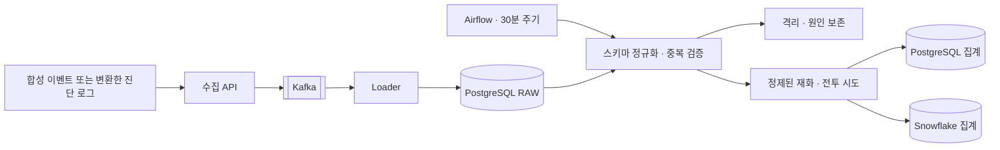

# game-log-pipeline


방치형 게임에서는 접속하지 않은 동안 쌓인 보상이 한꺼번에 지급됩니다. 짧은 시간의 재화 획득량만 보면 정상 지급도 이상행위로 분류될 수 있습니다. 이 프로젝트는 **로그 재전송**, **같은 거래의 중복 기록**, **중복 지급 의심**을 구분하는 데이터 파이프라인입니다.

Kafka로 받은 로그를 PostgreSQL에 보관하고, Airflow가 30분마다 정제·집계 결과를 갱신합니다. Snowflake에도 같은 집계 SQL을 적용합니다. 전투 시도 로그로는 단계별 도전·통과와 반복 실패 구간을 집계합니다.

## 구현과 확인 범위

| 항목 | 현재 상태 | 근거 |
|---|---|---|
| Python·SQLite 기준 구현 | 합성 입력, 중복 제거, 격리, 재처리 검사 | [검증 기록](docs/verification.md) |
| Kafka·PostgreSQL·Airflow | kind에서 수집부터 집계까지 실행 | [배포 기록](docs/kubernetes.md) |
| Helm·Kustomize·Argo CD | 로컬 클러스터 재구성과 Git 동기화 확인 | [배포 기록](docs/kubernetes.md) |
| Snowflake | 체험 계정에서 PostgreSQL 결과와 대조 | [실행 결과](docs/snowflake.md) |
| Prometheus·Grafana | 지표 수집, 경보 규칙, 대시보드 구성 | [모니터링](docs/kubernetes.md#모니터링-030) |
| 게임 진단 로그 어댑터 | 코드와 합성 샘플 검사 완료, 미릴리스 | [변환 규칙과 한계](docs/device-logs.md) |
| EKS | 설정·렌더링 검토 단계, 실제 배포 미실시 | [배포 전 미해결 사항](infra/eks/README.md) |

공개 샘플과 경제 수치는 별도로 만든 합성 데이터입니다. 게임 소스·아트·실제 기기 로그는 포함하지 않습니다. 버전별 변경은 [CHANGELOG](CHANGELOG.md)에 기록합니다.

## 중복을 구분하는 기준

- `event_id`: 같은 이벤트의 재전송을 한 번만 반영합니다. 같은 ID에 내용이 다르면 격리합니다.
- `transaction_id`: 이벤트 ID가 달라도 같은 지급 거래는 한 번 집계합니다. 거래 키의 범위는 이용자·재화입니다.
- `reward_claim_id`: 같은 보상 청구에 여러 거래가 있으면 중복 지급 조사 후보로 남깁니다.

클라이언트 로그만으로 부정행위를 확정하거나 자동 제재하지 않습니다.


그림 하단의 RAW 10건은 재화 전용 예제입니다. 현재 `demo`는 전투 시도 46건을 더해 총 56건을 생성합니다.

## 로컬 실행

Python 3.11 이상에서 기준 구현을 실행할 수 있습니다. 이 경로는 클라우드 계정이 필요 없습니다. 선택 의존성이 없으면 키 페어 인증 검사는 건너뜁니다.

```sh
python -m unittest discover -s tests -v
python -m game_log_pipeline demo --output runs/demo
python -m game_log_pipeline replay --input runs/demo/events.jsonl --output runs/demo
```

결과는 `runs/demo/report.json`과 `runs/demo/pipeline.sqlite`에 남습니다. 위의 `replay`는 같은 입력을 다시 수신하는 시험입니다. 아래 기대값은 비어 있는 출력 경로에서 `demo`를 한 번 실행한 뒤, `replay`를 한 번 실행한 경우입니다. 기존 경로를 재사용하면 RAW와 격리 이력이 계속 늘어납니다.

| 항목 | 첫 demo | 같은 입력 replay 후 |
|---|---:|---:|
| RAW | 56 | 112 |
| 정제된 재화 이벤트 | 6 | 6 |
| 정제된 전투 시도 | 42 | 42 |
| 격리 | 6 | 12 |
| 거래 | 6 | 6 |
| 재화 이상 후보 | 2 | 2 |

전투 시도 예제에서는 무한 도전 8단계에 통과 기록 없이 반복 실패한 이용자 3명과 실패 10회가 집계됩니다. 합성 데이터의 기대값이며 탐지 정확도나 처리량 평가 결과는 아닙니다.

게임 진단 로그 형식의 합성 샘플은 다음과 같이 변환합니다.

```sh
python -m game_log_pipeline adapt --input examples/device_diagnostic_sample.jsonl --player tester_01
python -m game_log_pipeline replay --input runs/device/attempts.jsonl --output runs/device
```

어댑터는 개발 보조를 사용한 전투와 전투 외 기록을 제외합니다. 실제 기기 자료의 보관 범위와 현재 보고서 출처 표기의 문제는 [연결 문서](docs/device-logs.md#한계)에 정리했습니다.

## 처리 흐름



이 그림은 클러스터 경로입니다. 위의 로컬 `demo`·`replay`는 Kafka 없이 SQLite로 같은 검증 규칙을 실행합니다.

클러스터의 재계산은 기본적으로 증분입니다. 대상별로 마지막 처리 RAW ID를 저장하고, 새 입력과 이벤트·거래 키가 연결된 과거 행까지 다시 계산합니다. 결과와 처리 위치는 대상 DB마다 한 트랜잭션으로 반영합니다. PostgreSQL과 Snowflake 전체를 묶는 분산 트랜잭션은 아닙니다. 테스트에서는 각 묶음의 증분 결과를 전체 재계산 결과와 비교합니다.

## 실행 화면

다음은 2026-09-29까지의 kind·합성 데이터 실행 기록입니다. 현재 운영 상태를 실시간으로 보여주는 화면은 아닙니다.


| Argo CD: 캡처 시점 앱 9개 Synced / Healthy | Airflow: 재계산 DAG 실행 기록 |
|---|---|
|  |  |

| Grafana: 수신량·소비 지연·마지막 커밋 이후 시간 | Snowflake: 재화 이상 후보 조회 |
|---|---|
|  |  |

Grafana의 빨간 값은 마지막 로더 커밋 이후 경과 시간입니다. 캡처에서 소비 지연은 0이며, 이 색상만으로 정체 경보가 발동했다고 볼 수 없습니다. 정체 경보에는 처리 대기 메시지가 있다는 조건도 필요합니다.

## 검증과 한계

- 최근 로컬 검사에서는 38개 중 37개가 통과했고, 선택 라이브러리 `cryptography`가 필요한 인증 검사 1개는 건너뛰었습니다. 실행 환경별 결과는 [검증 기록](docs/verification.md)을 참고하세요.
- 스키마 오류, 이벤트·거래 충돌, 재전송, 지연 도착, SQLite 재계산 실패 시 롤백을 검사합니다. 실제 Kafka·DB 사이의 장애 복구 검사는 후속 과제입니다.
- 증분 처리에는 단일 로더의 커밋 순서라는 전제가 있습니다. 현재 EKS의 로더 3개 설정은 이 전제와 맞지 않아 배포 전에 수정해야 합니다.
- `report.json`의 최상위 `source`는 현재 `synthetic`으로 고정돼 있습니다. 기기 입력의 출처를 판단하는 데 쓰지 않으며, 출처별 집계로 바꿀 예정입니다.
- `stage_funnel`은 관측된 기록의 단계별 도전·통과 집계입니다. 단계 간 이동 순서, 게임 버전, 관측 기간을 구분하는 분석은 아직 없습니다. 통과 기록이 없다는 사실만으로 실제 미통과를 확정할 수 없습니다.
- 실제 개인정보·기기 로그를 공개 저장소에 넣지 않습니다. 검증 전 RAW에 원문이 남으므로 필드 검사만으로 비공개 데이터 유입을 막을 수는 없습니다.
- 재화 소비·환불·서버 원장 대사, 인증·TLS, 처리량 측정, EKS 운영은 미검증 또는 후속 범위입니다.

## 다음 작업

1. 보고서의 출처 집계를 수정하고 단일 로더 전제를 배포 설정에서도 보장합니다.
2. DB 저장 직후 중단, 재전송, 재계산 실패 후 복구와 워터마크 롤백을 검사합니다.
3. 이상 후보·판단 근거·최근 갱신 시각을 반환하는 조회 API를 추가합니다.
4. 출처·게임 버전·관측 기간을 구분해 난이도 집계를 보강합니다.
5. 외부 API 수집과 부하 측정을 추가합니다. EKS 실배포와 LLM 연동은 그 뒤에 검토합니다.

[설계 결정](docs/decisions.md) · [트러블슈팅](docs/troubleshooting.md) · [게임 로그 연결](docs/device-logs.md) · [변경 이력](CHANGELOG.md)
