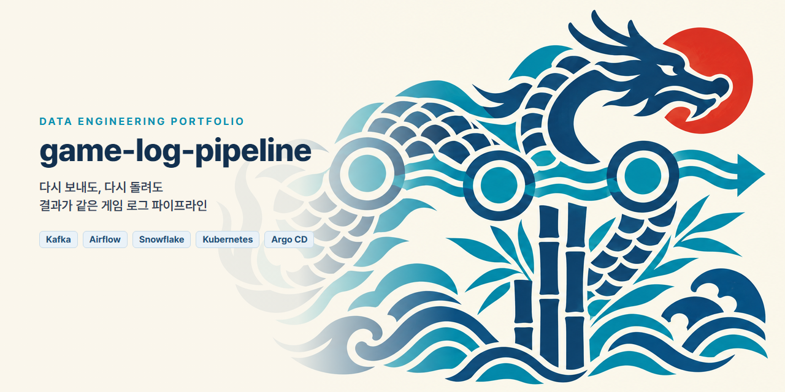
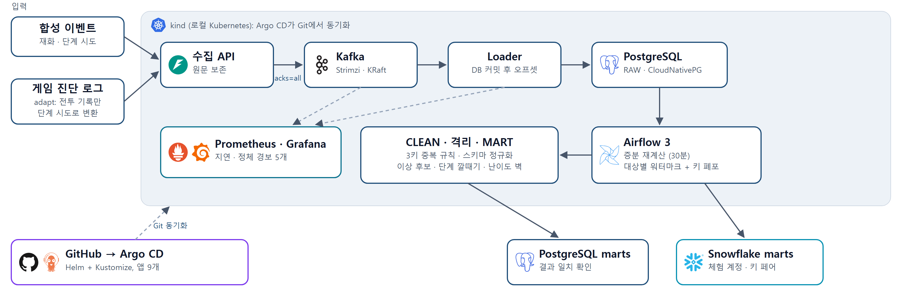
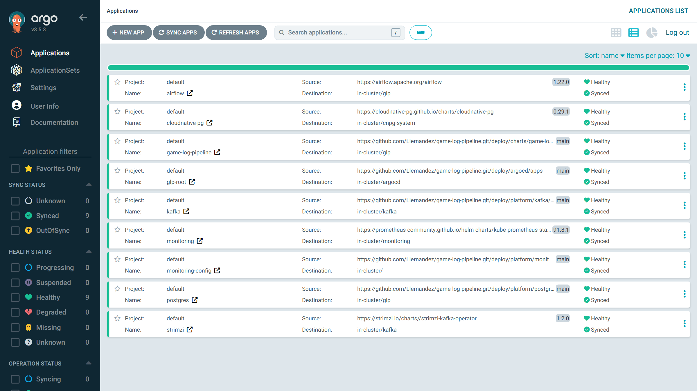
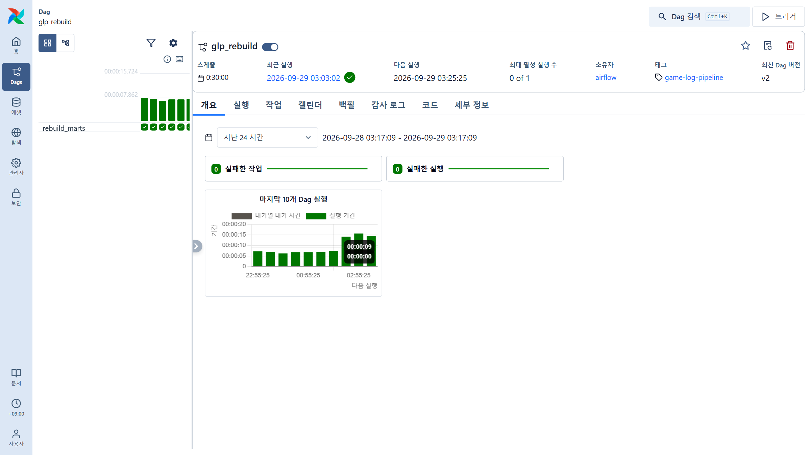
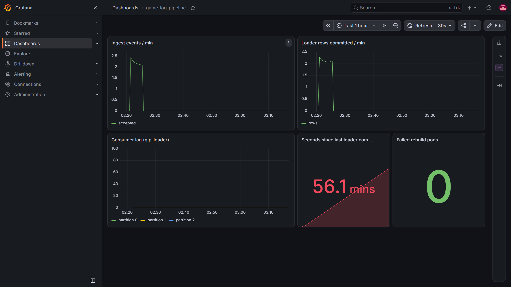
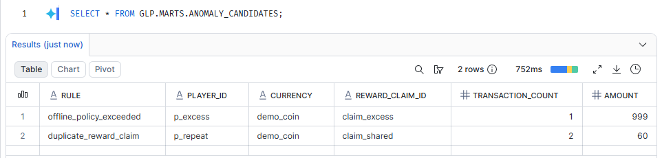
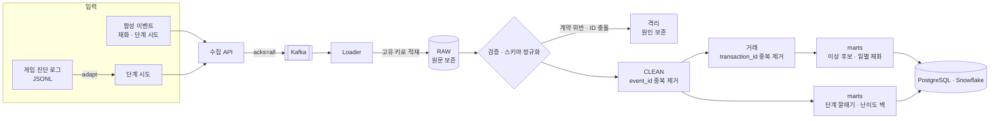
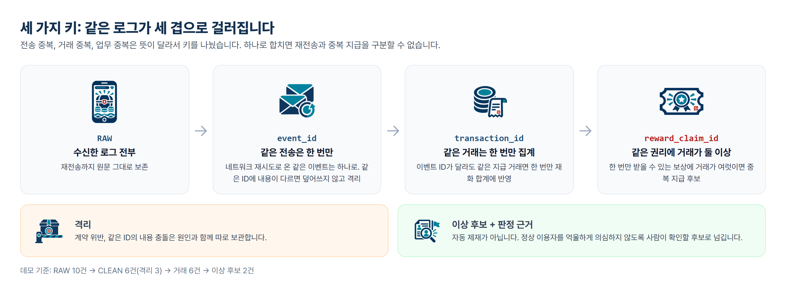

# game-log-pipeline



방치형 게임의 **정상 오프라인 보상**, **로그 전송 중복**, **실제 중복 지급 의심**을 구분하는 데이터 엔지니어링 포트폴리오입니다.

**v0.2.0**은 v0.1.0의 Python + SQLite 기준 규칙을 그대로 두고 **Kubernetes 위에서 FastAPI 수집 API → Kafka(Strimzi) → PostgreSQL(CloudNativePG) → Airflow(KubernetesPodOperator) 재계산**으로 확장했습니다. 배포는 **Helm 차트 + Kustomize 오버레이를 Argo CD(app-of-apps)가 Git에서 동기화**합니다. 로컬 kind 클러스터에서 end-to-end로 확인했습니다. Snowflake 적재는 체험 계정에서 실행해 PostgreSQL과 같은 결과를 확인했고 EKS는 설정까지 준비했습니다. → [Kubernetes 배포 문서](docs/kubernetes.md)

**게임 진단 로그 연결(Unreleased)**: 개발 중인 게임이 내보내는 진단 로그(JSONL)의 전투 기록을 `stage_attempt`로 바꾸는 어댑터입니다. 개발 보조를 쓴 판과 전투 외 기록은 넣지 않습니다. 기기 출처는 단계 시도에만 허용합니다. → [게임 로그 연결](docs/device-logs.md)

**v0.5.0**은 두 번째 입력 **단계 시도(`stage_attempt`)**를 받아 단계별 통과 깔때기와 **난이도 벽**(여러 이용자가 반복 실패하고 못 넘은 단계)을 계산합니다. 재화 이벤트와 같은 수집·격리·증분 재계산 경로를 탑니다.

**v0.4.0**은 재계산을 **증분**으로 바꿨습니다. 대상마다 워터마크를 두고, 새 RAW와 같은 이벤트·거래 키에 걸린 행만 다시 계산합니다. 결과는 매 묶음 전체 재계산과 대조 검사합니다.

**v0.3.0**은 운영 관점을 더했습니다. **스키마 진화**(생산자 버전 1~3을 함께 받아 정규화, 계약 위반 격리)와 **모니터링**(Prometheus·Grafana, Kafka 컨슈머 지연·로더 정체·재계산 실패 경보, 대시보드를 Git으로 관리)입니다.

게임 소스나 아트, 실제 사용자 로그를 포함하지 않습니다. 모든 이벤트와 경제 수치는 독립적인 합성 데이터이고 게임 로그 샘플도 형식만 같은 합성 데이터입니다.

## 실행 화면

로컬 kind 클러스터, 합성 데이터 기준입니다.



| Argo CD: 앱 9개 Synced / Healthy | Airflow: 재계산 DAG 30분 주기, 실패 0건 |
|---|---|
|  |  |

| Grafana: 처리량, 컨슈머 지연, 재계산 실패 (캡처 시점은 1시간 유휴라 로더 정체 경보가 켜진 상태) | Snowflake: 이상 후보, PostgreSQL과 같은 결과 |
|---|---|
|  |  |

## 문제

몇 시간 동안 쌓인 재화를 접속 직후 받는 정상 이용자는 단순한 분 단위 획득량 임계치를 넘을 수 있습니다. 전송 재시도는 매출/재화 집계를 부풀릴 수 있고 이벤트 ID가 다르더라도 같은 보상이 두 번 지급될 수 있습니다.

이 프로젝트는 세 가지 키를 구분합니다.

- `event_id`: 전송 재시도 식별. 같은 ID에 다른 내용이면 격리.
- `transaction_id`: 지급 거래 식별. 이벤트 ID가 달라도 같은 거래는 한 번 집계.
- `reward_claim_id`: 보상 수급 권리 식별. 같은 권리에 여러 거래가 있으면 조사 후보.

클라이언트가 보낸 로그만으로 부정행위를 확정하거나 제재하지 않습니다.

## 1분 실행

Python 3.11+만 필요합니다. 외부 Python 패키지와 클라우드 자격증명이 필요 없습니다.

```sh
python -m unittest discover -s tests -v
python -m game_log_pipeline demo --output runs/demo
python -m game_log_pipeline replay --input runs/demo/events.jsonl --output runs/demo
```

게임 진단 로그 형식의 샘플은 어댑터를 거쳐 같은 경로로 넣습니다.

```sh
python -m game_log_pipeline adapt --input examples/device_diagnostic_sample.jsonl --player tester_01
python -m game_log_pipeline replay --input runs/device/attempts.jsonl --output runs/device
```

`runs/demo/report.json`과 `pipeline.sqlite`를 확인합니다. 마지막 명령은 같은 원문을 다시 받는 시험입니다. RAW 건수는 늘지만 업무 집계·이상 후보는 변하지 않아야 합니다.

## 처리 흐름



원문(RAW)과 정제 결과를 분리하고 재계산은 한 트랜잭션으로 교체합니다. 클러스터에서는 Airflow가 30분마다 대상별 워터마크 이후 RAW만 읽고 같은 이벤트·거래 키에 걸린 행까지 범위를 넓혀 **증분 재계산**합니다. 로컬 SQLite 기준 구현은 같은 규칙으로 전체를 재계산하며 증분 결과는 이 기준과 대조 검사합니다.



## 포함된 시나리오

| 입력 | 기대 |
|---|---|
| 정상 2시간 부재 정산 | 단순 임계치에는 걸리지만 정산 규칙에는 정상 |
| 같은 이벤트 재전송 | 집계 불변 |
| 새 이벤트 ID로 같은 거래 전달 | 거래 합계 불변 |
| 같은 보상 권리에 별도 거래 2건 | 중복 지급 후보 |
| 공개 데모 정책의 지급 상한 초과 | 정책 초과 후보 |
| 전일 이벤트 지연 도착 | 전일 집계 반영 |
| 스키마 오류·동일 ID 내용 충돌 | 격리 |
| 정제 중 DB 실패 | 기존 정제 상태 유지 |
| 스키마 v1·v2·v3 혼재 (v3는 필드 이름 변경) | 모두 같은 업무 형태로 정규화 |
| 같은 이벤트를 업그레이드된 클라이언트가 새 버전으로 재전송 | 충돌 아님, 한 번 집계 |
| 지원하지 않는 버전·필수 필드 누락 | 사유와 함께 격리 |

첫 demo의 기대값: RAW **10**, CLEAN **6**, 격리 **3**, 거래 **6**, 이상 후보 **2**.
정상 이용자 `p_normal`의 일시적 큰 지급이 단순 임계치의 오탐 사례입니다. 일반적인 정확도·처리량을 증명하는 대규모 평가가 아닙니다.

## 검증과 한계

- 로컬 Python 3.11에서 단위/통합 검사 38개와 CLI 실행으로 확인합니다. 실제 실행 증거는 [검증 기록](docs/verification.md), 클러스터 실행 결과는 [Kubernetes 배포 문서](docs/kubernetes.md).
- `schema.sql`은 SQLite 기준 구현용입니다. 웨어하우스용 `marts.sql`은 PostgreSQL과 Snowflake가 함께 받는 SQL이며 두 곳 모두에서 실행해 같은 결과를 확인했습니다.
- 재화 이벤트는 합성 source만 받습니다. 단계 시도는 게임 진단 로그 어댑터의 출력(`device_diagnostic`)도 받습니다. 실제 개인정보와 실제 기기 로그를 저장소에 넣지 마세요. RAW에는 입력 원문이 남습니다.
- 재화 획득 사건만 다루며 소비·환불·전체 원장 대사는 후속 범위입니다.
- 기간·정책·플레이어 속성은 합성 데이터의 전제입니다. 실제 서비스는 신뢰할 수 있는 서버 원장과 대조해야 합니다.
- CI 정의는 포함되며 실행 상태는 GitHub Actions에서 확인합니다.

## 다음 단계

완료(v0.2.0): Kafka producer/consumer, Airflow 스케줄 재계산, kind + Helm + Kustomize + Argo CD.
완료(v0.3.0): 스키마 진화(upcasting), Prometheus·Grafana 모니터링과 경보, Snowflake 적재 실행 확인(PostgreSQL marts와 같은 결과, [절차·결과](docs/snowflake.md)).
완료(v0.4.0): 증분 재계산(대상별 워터마크, 키 기준 영향 범위, 전체 재계산과 결과 대조 검사).
완료(v0.5.0): 단계 시도 입력, 단계별 통과 깔때기와 난이도 벽.
진행(Unreleased): 게임 진단 로그 어댑터. 출시 후 비공개 수집 API와 보관 정책은 별도로 정합니다.

3. 수집 API 인증·요청 제한, 조회 API
4. EKS 실제 배포(ALB, ESO, IRSA)와 부하 시험
5. 필요 시 근거 요약 LLM API

[설계 결정](docs/decisions.md) · [트러블슈팅](docs/troubleshooting.md) · [게임 로그 연결](docs/device-logs.md) · [변경 이력](CHANGELOG.md)
