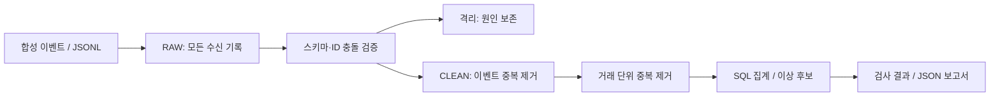

# game-log-pipeline

방치형 게임의 **정상 오프라인 보상**, **로그 전송 중복**, **실제 중복 지급 의심**을 구분하는 데이터 엔지니어링 포트폴리오입니다.

현재 **v0.1.0은 Python + SQLite로 실행하는 로컬 기준 구현**입니다. Kafka·Snowflake·Airflow·FastAPI·Kubernetes는 후속 단계이며 현재 구현했다고 주장하지 않습니다. 게임 소스나 아트, 실제 사용자 로그를 포함하지 않습니다. 모든 이벤트와 경제 수치는 독립적인 합성 데이터입니다.

## 문제

몇 시간 동안 쌓인 재화를 접속 직후 받는 정상 이용자는 단순한 분 단위 획득량 임계치를 넘을 수 있습니다. 전송 재시도는 매출/재화 집계를 부풀릴 수 있고, 이벤트 ID가 다르더라도 같은 보상이 두 번 지급될 수 있습니다.

이 프로젝트는 세 가지 키를 구분합니다.

- `event_id`: 전송 재시도 식별. 같은 ID에 다른 내용이면 격리.
- `transaction_id`: 지급 거래 식별. 이벤트 ID가 달라도 같은 거래는 한 번 집계.
- `reward_claim_id`: 보상 수급 권리 식별. 같은 권리에 여러 거래가 있으면 조사 후보.

클라이언트가 보낸 로그만으로 부정행위를 확정하거나 제재하지 않습니다.

## 1분 실행

Python 3.11+만 필요합니다. 외부 Python 패키지와 클라우드 자격증명이 필요 없습니다.

```sh
python -m unittest discover -s tests -v
python -m game_log_pipeline demo --output runs/demo
python -m game_log_pipeline replay --input runs/demo/events.jsonl --output runs/demo
```

`runs/demo/report.json`과 `pipeline.sqlite`를 확인합니다. 마지막 명령은 동일 원문을 다시 수신하는 시험입니다. RAW 건수는 증가하지만 업무 집계·이상 후보는 변하지 않아야 합니다.

## 현재 구조



원문과 정제 결과를 분리하고 전체 재계산을 단일 트랜잭션으로 처리합니다. 순서 역전·지연 도착은 보존한 원문 전체를 재계산해 반영합니다. 이 방식은 소규모 정답 기준 구현이며, 대규모 증분 처리나 실시간 스트리밍이라고 부르지 않습니다.

## 포함된 시나리오

| 입력 | 기대 |
|---|---|
| 정상 2시간 부재 정산 | 단순 임계치에는 걸리지만 정산 규칙에는 정상 |
| 같은 이벤트 재전송 | 집계 불변 |
| 새 이벤트 ID로 같은 거래 전달 | 거래 합계 불변 |
| 같은 보상 권리에 별도 거래 2건 | 중복 지급 후보 |
| 공개 데모 정책의 지급 상한 초과 | 정책 초과 후보 |
| 전일 이벤트 지연 도착 | 전일 집계 반영 |
| 스키마 오류·동일 ID 내용 충돌 | 격리 |
| 정제 중 DB 실패 | 기존 정제 상태 유지 |

첫 demo의 기대값: RAW **10**, CLEAN **6**, 격리 **3**, 거래 **6**, 이상 후보 **2**.
정상 이용자 `p_normal`의 일시적 큰 지급이 단순 임계치의 오탐 사례입니다. 일반적인 정확도·처리량을 증명하는 대규모 평가가 아닙니다.

## 검증과 한계

- 로컬 Python 3.11에서 단위/통합 검사 12개와 CLI 실행으로 확인합니다. 실제 실행 증거는 [검증 기록](docs/verification.md).
- `schema.sql`은 SQLite용입니다. Snowflake 호환을 검증하지 않았습니다.
- 공개 fixture는 합성 source만 받습니다. 실제 개인정보를 넣지 마세요. RAW에는 입력 원문이 남습니다.
- 재화 획득 사건만 다루며 소비·환불·전체 원장 대사는 후속 범위입니다.
- 기간·정책·플레이어 속성은 합성 데이터의 전제입니다. 실제 서비스는 신뢰할 수 있는 서버 원장과 대조해야 합니다.
- CI 정의는 포함되며 실행 상태는 GitHub Actions에서 확인합니다.

## 다음 단계

1. Kafka producer/consumer와 재시작·재전송 테스트
2. Snowflake RAW/CLEAN/MART, 커넥터 버전/전달 보장 명시
3. Airflow 구간 변환, 지연 도착·backfill·재시도
4. 조회 API 및 L7 요청 경로·장애 진단
5. Steam 관측 수집, kind/Ingress/Helm
6. 필요 시 근거 요약 LLM API

[설계 결정](docs/decisions.md) · [변경 이력](CHANGELOG.md)
